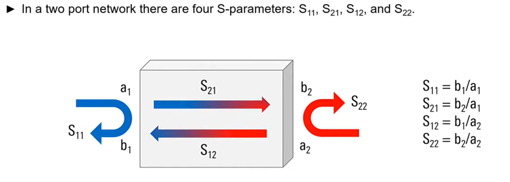
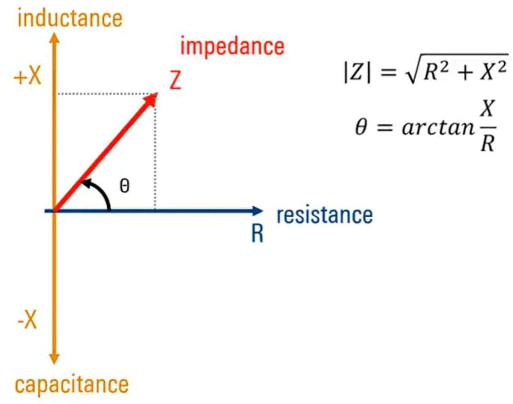
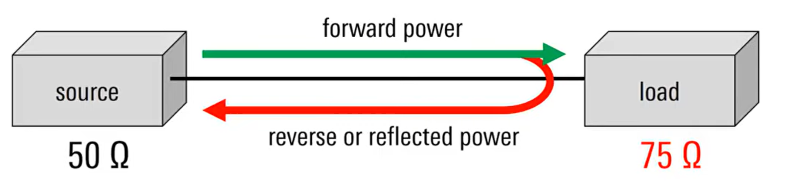
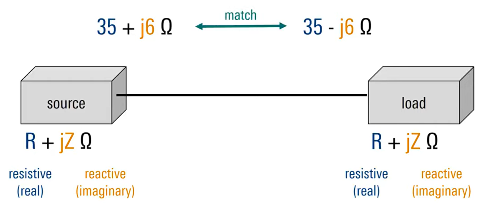
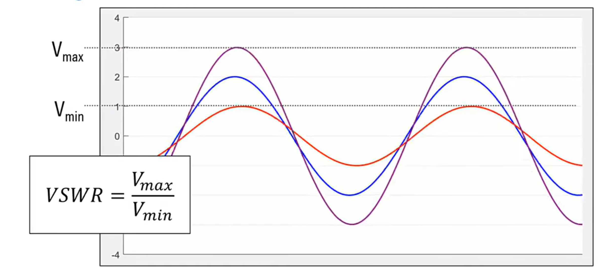
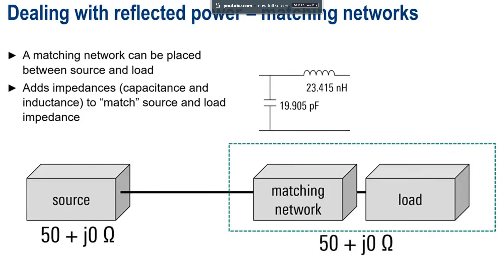
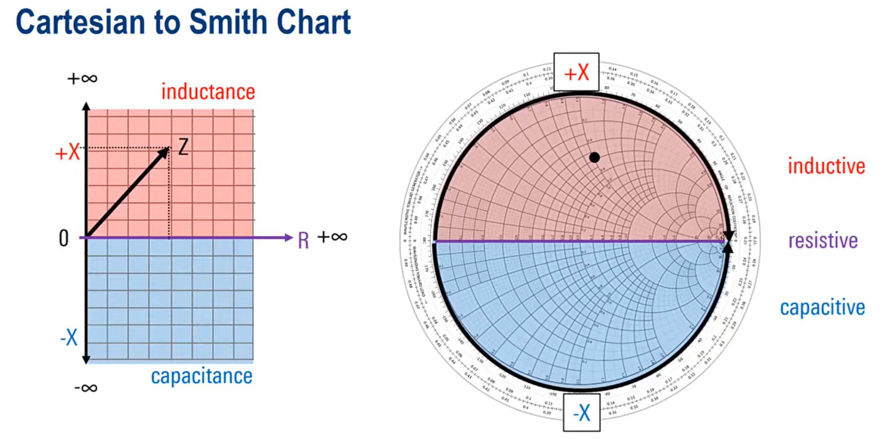
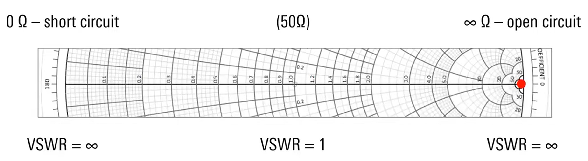
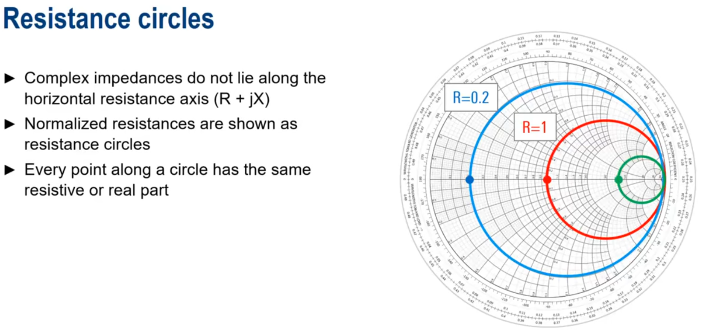
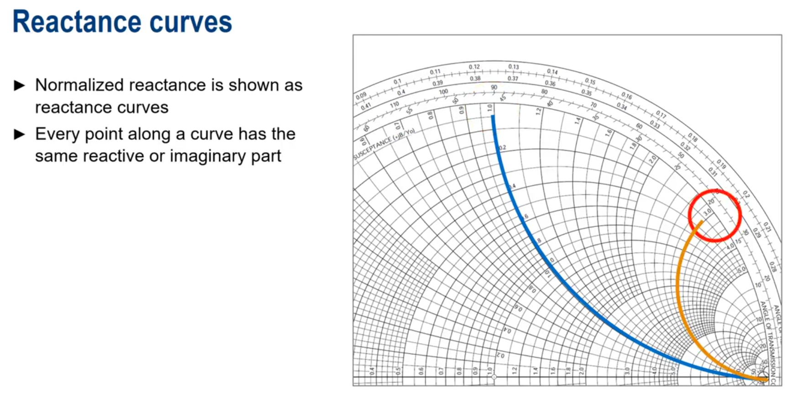

# Document de prise de notes

Lors de ce travail de bachelor, j'ai de temps en temps regardé de la théorie par rapport à l'abaque de Smith donc voici les notes que j'ai pu en retirer. Les notes sont ensuite reformulée pour plus de clarté avec différents outils d'intelligence artificielle.

## Trilogie de Rohde & Schwarz

### [Understanding S Parameters](https://www.youtube.com/watch?v=-Pi0UbErHTY) :

Un réseau (Network) est un dispositif avec un ou plusieurs ports.
Chaque port peut laisser passer, absorber et/ou réfléchir l'énergie RF. Exemples : une antenne avec un port, un filtre ou un amplificateur avec deux ports, un coupleur ou un mélangeur avec trois ports.

Ces dispositifs peuvent être analysés en envoyant de l'énergie RF dans un port et en mesurant la réflexion ou ce qui en ressort aux autres ports.

Les Paramètres S (scattering parameters) sont notés $S_{xy}$.

Dans un réseau à deux ports, il y a quatre paramètres S : S11, S21, S12 et S22.

*   $S_{11}$ : Coefficient de réflexion d'entrée. Il est lié à l'**adaptation d'entrée**, la **perte au retour (Return Loss)** et le **VSWR** côté entrée.
*   $S_{22}$ : Coefficient de réflexion de sortie. Il est lié à l'**adaptation de sortie**, la **perte au retour (Return Loss)** et le **VSWR** côté sortie.
*   $S_{21}$ : Coefficient de transmission directe. Il représente le **gain en transmission directe** (si > 1) ou la **perte d'insertion** (si < 1) du port 1 au port 2. C'est un paramètre clé pour la performance des amplificateurs ou des filtres.
*   $S_{12}$ : Coefficient de transmission inverse. Il représente l'**isolation** ou le gain en transmission inverse du port 2 au port 1. Pour de nombreux dispositifs (comme les amplificateurs unidirectionnels), on souhaite que cette valeur soit la plus faible possible.

Les paramètres S peuvent être représentés sous forme de matrices, et les coefficients de réflexion ($S_{11}$ et $S_{22}$) peuvent être tracés sur un abaque de Smith.

### [Understanding VSWR and Return Loss](https://www.youtube.com/watch?v=-Pi0UbErHTY) :

Tout d'abord, qu'est-ce qu'une impédance ?
C'est une valeur complexe (Z) qui se compose de :

*   Une Résistance (R) qui ne change **pas** avec la fréquence.
*   Une Réactance (X) qui **change** avec la fréquence. Il existe deux types :
    *   Capacitive (C)
    *   Inductive (L)

L'impédance varie donc en fonction de la fréquence.

**Exemple :** L'impédance des antennes varie beaucoup en fonction de la fréquence, c'est pourquoi elles ont des valeurs de fréquence où elles devraient être utilisées.

Lorsque l'impédance de la source correspond à l'impédance de la charge, on parle d'adaptation parfaite, et tout correspond idéalement.

**Désadaptation (Mismatch)** : Une partie de la puissance de la source est réfléchie de la charge vers la source, ce qui est indésirable car cela réduit l'efficacité du transfert de puissance.

En réalité, toutes les impédances ont deux parties :

*   Une partie réelle, résistive (R)
*   Une partie imaginaire, réactive ($jX$)

Une impédance complexe est adaptée par son **conjugué complexe**.

L'adaptation par conjugué complexe ($Z_L = Z_S^*$) est cruciale pour un transfert de puissance maximal car elle annule les parties réactives de l'impédance, ne laissant que les résistances pour dissiper l'énergie utile.

Nous devons quantifier la puissance réfléchie. Pour cela, deux méthodes principales sont utilisées :

*   La Perte au Retour (Return Loss)
*   Le Taux d'Ondes Stationnaires (Voltage Standing Wave Ratio - VSWR)

#### Perte au Retour (Return Loss - RL)

La Perte au Retour (RL) est une mesure en décibels (dB) qui quantifie le rapport entre la puissance incidente et la puissance réfléchie. Une valeur de RL plus élevée indique moins de puissance réfléchie et donc une meilleure adaptation d'impédance. Elle ne peut jamais être négative.

$$
\text{Return Loss (dB)} = 10 \log_{10} \left( \frac{P_{incident}}{P_{réfléchie}} \right) = -20 \log_{10} (|\Gamma|)
$$

#### Ondes stationnaires et VSWR

Les ondes stationnaires résultent de l'addition de l'onde de tension incidente (en bleu) et de l'onde de tension réfléchie (en rouge). Les ondes stationnaires sont représentées par l'onde violette.

Le VSWR (Voltage Standing Wave Ratio) est le rapport entre l'amplitude maximale et l'amplitude minimale que peut atteindre l'onde stationnaire.

Pour le calculer mathématiquement, nous commençons par le coefficient de réflexion $\Gamma$ :

$$
\Gamma = \frac{Z_L - Z_0}{Z_L + Z_0}
\qquad
VSWR = \frac{1 + |\Gamma|}{1 - |\Gamma|}
$$

Le Return Loss peut aussi être exprimé en fonction du VSWR :
$$
\text{Return Loss (dB)} = 20 \log_{10} \left( \frac{VSWR + 1}{VSWR - 1} \right)
$$
Où $Z_L$ est l'impédance de la charge et $Z_0$ est l'impédance de la source.

### [Understanding the Smith Chart](https://www.youtube.com/watch?v=rUDMo7hwihs)

L'abaque de Smith est un outil graphique utilisé pour l'adaptation d'impédance. Il permet de résoudre les problèmes d'adaptation de manière visuelle, facilitant ainsi la compréhension des impédances et de la performance de l'adaptation.

L'abaque représente l'impédance de la charge ($Z_L$) par rapport à l'impédance caractéristique ou de référence ($Z_0$).

Les difficultés à représenter cette relation sur un plan cartésien sont :
*   Les résistances sont toujours positives, nous n'utiliserions donc que le côté droit du plan.
*   Les impédances (et résistances) peuvent varier de 0 à l'infini.

Le point central de l'abaque est appelé le **centre de l'origine (prime center)**. Il représente l'impédance de source $Z_0$, qui est généralement de 50 Ohms dans la plupart des systèmes RF, mais il est normalisé à 1,0 sur l'abaque.

Cette normalisation permet d'utiliser le même abaque de Smith pour n'importe quel système, quelle que soit son impédance caractéristique $Z_0$.

Idéalement, on souhaite que l'impédance de la charge $Z_L$ soit égale à l'impédance de la source $Z_0$.

L'impédance mesurée $Z_L$ est tracée sur l'abaque de Smith. L'objectif est de trouver un moyen de déplacer ce point $Z_L$ aussi près que possible du centre de l'abaque (c'est-à-dire vers $Z_0$) en utilisant un réseau d'adaptation.

Au milieu de l'abaque, l'axe horizontal représente l'axe des résistances pures (où la réactance est nulle).

*   **VSWR = $\infty$ (Short circuit)** : Représente une impédance de 0 $\Omega$.
*   **VSWR = 1 (Matched load)** : Représente une impédance parfaitement adaptée ($Z_L = Z_0$).
*   **VSWR = $\infty$ (Open circuit)** : Représente une impédance infinie ($\infty \Omega$).

*   Les impédances complexes ne se situent pas le long de l'axe horizontal (R + jX).
*   Les résistances normalisées sont représentées par des **cercles de résistance**.
*   Chaque point le long d'un cercle a la même partie résistive (ou réelle) normalisée.

*   Les réactances normalisées sont représentées par des **courbes de réactance**.
*   Chaque point le long d'une courbe a la même partie réactive (ou imaginaire) normalisée.

## Notes liées à ce que veux le prof de TB

- Il faut quelque part toujours indiqué la fréquence à laquelle on travail.
- 